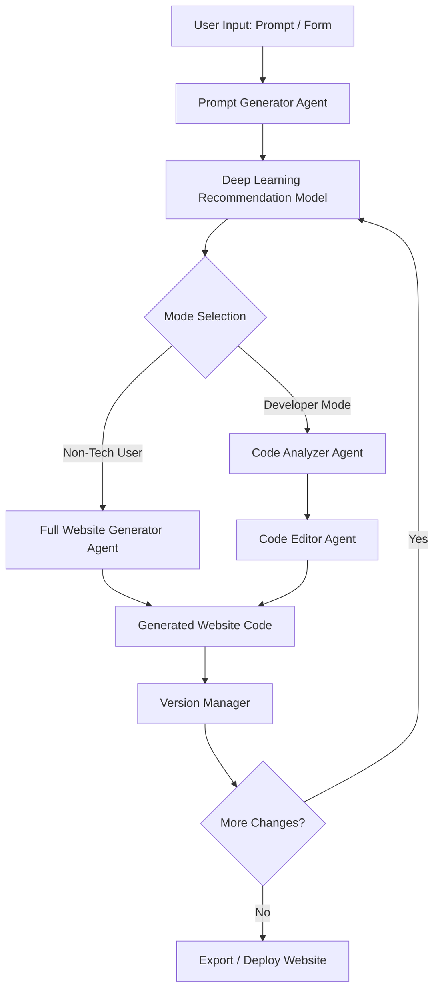

# 🌐 AI Website Builder — Multi-Agent, DL-Powered & Developer-Friendly 🚀

> Build complete websites from natural language, assist developers with code-aware AI, get smart feature recommendations using Deep Learning, and manage everything with version control — all in one intelligent platform.

---

## ✨ What is this?

An AI-driven, multi-agent website builder that supports:
- 🧑‍🎨 **Non-Tech Users** → Generate full websites from prompts  
- 👨‍💻 **Developers** → AI-assisted editing & completion of existing code  
- 🧠 **Deep Learning Recommendations** → Smart feature suggestions users may want  
- 🔄 **Versioning System** → Track, compare & rollback changes  
- ⚙️ **Framework Selection** → React / Next.js / Vue / etc.

Built with **LangGraph** for orchestration + a **Deep Learning model** for intelligent recommendations.

---

## 🧠 Core Idea

Instead of a single AI call, this project uses **multiple specialized agents** working together in a workflow:
- Prompt understanding
- Smart recommendations
- Conditional flow (Dev vs Non-Tech)
- Code generation / editing
- Version tracking
- Deployment preparation

---

## 🔁 System Flow

