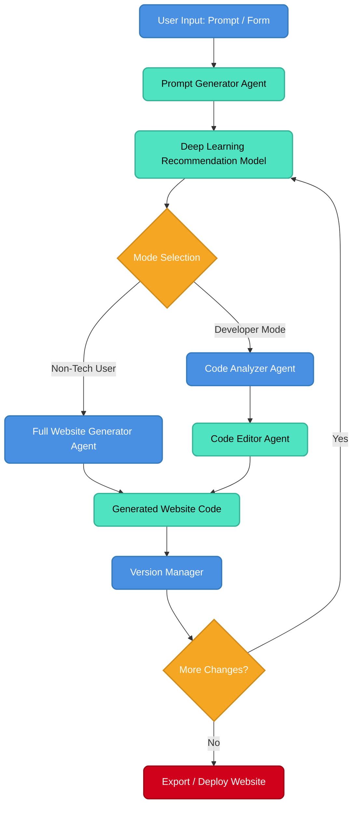

<div align="center">
  
# 🌐 AI Website Builder
### Multi-Agent, Deep Learning-Powered & Developer-Friendly

[](https://reactjs.org/)
[](https://nodejs.org/)
[](https://vitejs.dev/)
[](https://www.mongodb.com/)
[](https://python.langchain.com/docs/langgraph)

> *Build complete websites from natural language, assist developers with code-aware AI, get smart feature recommendations using Deep Learning, and manage everything with version control — **all in one intelligent platform**.*

</div>

---

## 📑 Table of Contents
- [✨ Features](#-features)
- [🧠 Core Architecture](#-core-architecture)
- [🔁 System Flow](#-system-flow)
- [🛠️ Tech Stack](#️-tech-stack)
- [🚀 Getting Started (Local Setup)](#-getting-started)
- [🤝 Contributing](#-contributing)

---

## ✨ Features

Our AI-driven, multi-agent platform is built to cater to everyone from complete beginners to advanced engineers:

- 🧑‍🎨 **Non-Tech Users** → Generate full, responsive, and beautiful websites strictly from natural language prompts.
- 👨‍💻 **Developers** → Use the AI as a pair programmer to edit, refactor, and complete existing codebases modularly.
- 🧠 **Deep Learning Recommendations** → Our DL model analyzes inputs to provide smart, contextual feature suggestions that users *didn't even know they needed*.
- 🔄 **Intelligent Versioning** → Safely track, compare, and rollback AI-generated iterations. Never lose a good design.
- ⚙️ **Multi-Framework Export** → Export your generated AI code directly to React, Vue, Next.js, or vanilla HTML/JS.

---

## 🧠 Core Architecture

Instead of relying on a fragile, single monolithic AI call, our system utilizes **LangGraph** to coordinate multiple specialized autonomous agents. Each agent acts as an expert in a specific domain:

1. **Prompt Understanding Agent** - Translates human language into technical specs.
2. **Recommendation Engine** - Intercepts specs to enrich them with predictive UI features.
3. **Router Agent** - Conditionally routes logic depending on if the user is a Dev or Non-Tech.
4. **Generator / Editor Agent** - The core builder that drafts or modifies the code.
5. **Version Controller** - Ensures diffs are saved safely.

---

## 🔁 System Flow



---

## 🛠️ Tech Stack

### Frontend
* **React.js 18** - UI Library
* **Vite** - Lightning-fast build tool
* **React Router v7** - Client-side routing

### Backend
* **Node.js & Express** - API server framework
* **MongoDB & Mongoose** - Document database
* **LangGraph (JS)** - Multi-agent orchestration framework
* **OpenAI API / Groq** - Large Language Models execution

---

## 🚀 Getting Started

Follow these instructions to run the AI Website Builder locally on your machine.

### 1. Prerequisites
Ensure you have the following installed:
* [Node.js](https://nodejs.org/) (v18 or higher recommended)
* [MongoDB](https://www.mongodb.com/try/download/community) (Running locally on port `27017`)
* An active [OpenAI API Key](https://platform.openai.com/)

### 2. Clone the Repository
```bash
git clone https://github.com/your-username/AI_Agent_Website_builder_from_Natural_Language_Prompt.git
cd AI_Agent_Website_builder_from_Natural_Language_Prompt
```

### 3. Environment Setup
Create a `.env` file in the root of the project by copying the example file:
```bash
cp .env.example .env
```
Inside your new `.env` file, populate your API keys and configuration:
```env
PORT=5000
MONGO_URI=mongodb://localhost:27017/ai-builder
OPENAI_API_KEY=your_actual_openai_api_key_here
```

### 4. Install Dependencies
You will need to install the Node modules for **both** the frontend and backend.

**For Frontend:**
```bash
cd frontend
npm install
```

**For Backend:**
```bash
cd backend
npm install --legacy-peer-deps
```

### 5. Running the Application
Open two separate terminal windows.

**Terminal 1 (Frontend):**
```bash
cd frontend
npm run dev
# The React app will launch on http://localhost:3000
```

**Terminal 2 (Backend):**
```bash
cd backend
npm run dev
# The Express API will listen on http://localhost:5000
```

---

## 🤝 Contributing
Contributions, issues, and feature requests are welcome!  
Feel free to check out the [issues page](https://github.com/your-username/AI_Agent_Website_builder_from_Natural_Language_Prompt/issues) if you want to contribute.

<div align="center">
  Made with ❤️ by the AI Website Builder Team
</div>
